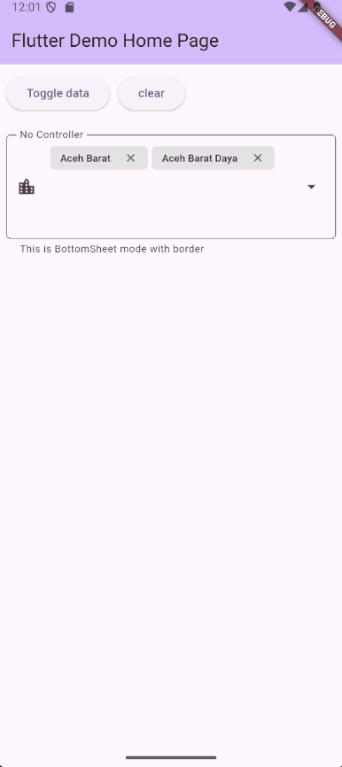
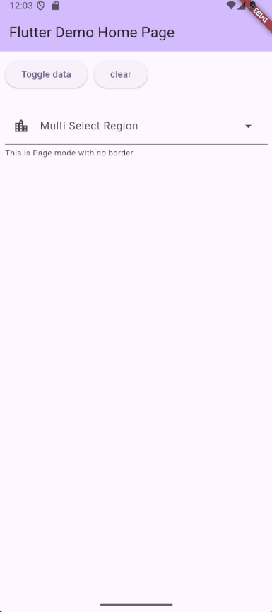
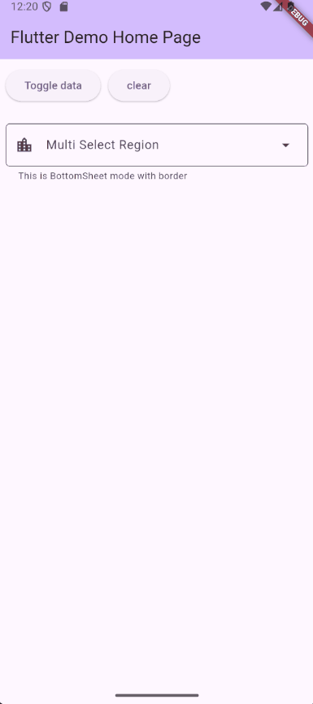
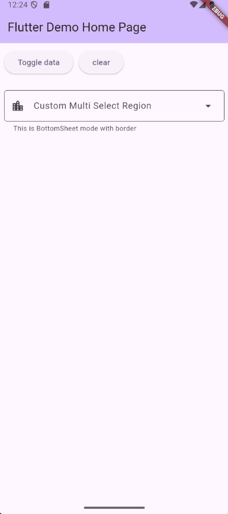
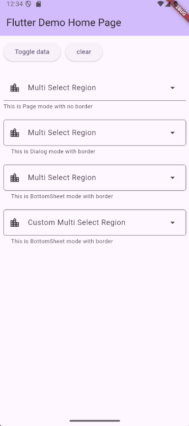

# 🧮 MultiDataPicker

  [](https://github.com/semutKecil/multi_data_picker/actions/workflows/publish.yml) [](https://saweria.co/hrlns) [](https://ko-fi.com/M4M81N5IYI)

**`multi_data_picker`** is a customizable multi-select widget for Flutter, inspired by Select2. It supports dynamic data, generic types, popup customization (dialog, page, bottom), and external control via `MultiPickerController`.

Designed for seamless form integration with full `InputDecoration` styling—ideal for filters, tag selectors, and data-driven UIs.

---

## 🤝 How to Contribute

Before diving into the docs, here’s how you can support the plugin:

- 🐞 **Found a bug or have an idea?**  
  Open an issue on [GitHub](https://github.com/semutKecil/multi_data_picker/issues)

- 🔧 **Got time to fix it?**  
  Fork the repo and submit a pull request—we’ll review it fast

- 💖 **Want to support the project?**  
  If this plugin makes your life easier, a small donation helps us keep building and improving it for everyone 
  
  [](https://saweria.co/hrlns) [](https://ko-fi.com/M4M81N5IYI)

- 👍 **Like what you see?**  
  Smash the thumbs-up on pub.dev—it helps more devs discover us!

---

## 📘 Table of Contents

- [🧮 MultiDataPicker](#-multidatapicker)
  - [🤝 How to Contribute](#-how-to-contribute)
  - [📘 Table of Contents](#-table-of-contents)
  - [✨ Features](#-features)
  - [📸 Demo](#-demo)
  - [📦 Installation](#-installation)
  - [🚀 Usage](#-usage)
    - [🧩 Notes on AnyField Integration](#-notes-on-anyfield-integration)
  - [🧱 Constructor Parameters](#-constructor-parameters)
  - [🧩 Display Builder](#-display-builder)
    - [1. `DataDisplayBuilder.string`](#1-datadisplaybuilderstring)
    - [2. `DataDisplayBuilder.custom`](#2-datadisplaybuildercustom)
  - [🪟 Popup Types](#-popup-types)
    - [1. `dialog`](#1-dialog)
    - [2. `page`](#2-page)
    - [3. `bottom`](#3-bottom)
    - [🪟 Popup Type Parameters](#-popup-type-parameters)
  - [🔄 Handling Data Loading \& Infinite Scroll](#-handling-data-loading--infinite-scroll)
    - [🧠 Parameters](#-parameters)
    - [✅ Returning Data](#-returning-data)
    - [❌ Returning Error](#-returning-error)
    - [🔁 Infinite Scroll Behavior](#-infinite-scroll-behavior)
    - [🧪 Example](#-example)
  - [🧾 List Data Builder](#-list-data-builder)
    - [1. `ListDataBuilder.string`](#1-listdatabuilderstring)
    - [2. `ListDataBuilder.custom`](#2-listdatabuildercustom)
    - [🧾 ListDataBuilder Parameters](#-listdatabuilder-parameters)
    - [🧾 ListTileMetadata](#-listtilemetadata)
  - [🎮 MultiPickerController](#-multipickercontroller)
    - [Example](#example)
    - [🎮 Controller API](#-controller-api)
  - [📄 License](#-license)


## ✨ Features

- ✅ Generic support for any data type `T`
- 🧱 Custom display builder (text or widget)
- 🪟 Popup picker: `dialog`, `page`, or `bottom`
- 🎛️ Controller support for external state management
- 🧩 TextField-style appearance via `InputDecoration`
- 🔄 Initial value and change detection hooks
- 📐 Layout, spacing, and tile styling options

---

## 📸 Demo

| Fix Height | Dialog Picker | Page Picker |
|----------|------|-------------|
|  |  |  |

| Bottom Picker | Custom | With Controller |
|----------|------|-------------|
|  |  |  |

---

## 📦 Installation

Add this to your `pubspec.yaml`:

```yaml
dependencies:
  multi_data_picker: ^<latest_version>
```

Then run:

```bash
flutter pub get
```

---

## 🚀 Usage

```dart
MultiDataPicker<Map<String, dynamic>>(
  initialValue: [data[0], data[1]],
  isEqual: (a, b) => a["id"] == b["id"],
  decoration: InputDecoration(
    labelText: "Input Label",
    prefixIcon: Icon(Icons.location_city),
    border: OutlineInputBorder(
      borderRadius: BorderRadius.circular(5),
    ),
  ),
  minHeight: 100,
  maxHeight: 150,
  dataDisplayBuilder: DataDisplayBuilder.string(
    labelBuilder: (data) => data['name'] ?? "-",
  ),
  popupType: DataPickerPopupType.bottom(
    loadData: loadData,
    listDataBuilder: ListDataBuilder.string(
      labelBuilder: (data) => data['name'] ?? "-",
    ),
  ),
)
```

---

### 🧩 Notes on AnyField Integration

`multi_data_picker` is built on top of [`any_field`](https://pub.dev/packages/any_field), which provides the core layout and interaction model. As a result, it inherits several important behaviors:

`isDense` is always `true`

To maintain compact vertical spacing, `AnyField` sets `InputDecoration.isDense = true` by default. This affects how icons and padding are rendered.

- **If you use `prefixIcon` or `suffixIcon`**, explicitly set their size to `24.0` to match the default `TextField` appearance:

```dart
InputDecoration(
  labelText: 'Tags',
  suffixIcon: Icon(Icons.tag, size: 24), // Match native TextField alignment
)
```

---

## 🧱 Constructor Parameters

| Parameter | Type | Description |
|----------|------|-------------|
| `dataDisplayBuilder` | `DataDisplayBuilder<T>` | Defines how each selected item is rendered ([see details](#-display-builder)) |
| `popupType` | `DataPickerPopupType<T>` | Controls the popup dialog behavior ([see details](#-popup-types)) |
| `isEqual` | `bool Function(T a, T b)?` | Optional equality function for comparing items. **Required when controller not exist** |
| `controller` | `MultiPickerController<T>?` | Optional controller to manage selected values ([see details](#-multipickercontroller)) |
| `initialValue` | `List<T>?` | Initial selected values |
| `decoration` | `InputDecoration` | Input field decoration |
| `onChanged` | `Function(List<T>)?` | Callback when selection changes |
| `displaySpacing` | `double` | Horizontal spacing between items |
| `displayRunSpacing` | `double` | Vertical spacing between wrapped items |
| `minHeight` / `maxHeight` | `double?` | Height constraints |

---

## 🧩 Display Builder

The `DataDisplayBuilder<T>` sealed class defines how each selected item is rendered inside the picker. It supports two modes:

### 1. `DataDisplayBuilder.string`

Renders each item as a `Chip` with customizable appearance.

```dart
DataDisplayBuilder.string(
  labelBuilder: (data) => data['name'] ?? "-",
  backgroundColor: Colors.blue.shade50,
  labelStyle: TextStyle(fontWeight: FontWeight.bold),
  shape: StadiumBorder(),
  deleteIconColor: Colors.red,
  deleteIcon: Icon(Icons.close),
  avatar: CircleAvatar(child: Text("A")),
  avatarBoxConstraints: BoxConstraints.tight(Size(24, 24)),
  labelPadding: EdgeInsets.symmetric(horizontal: 8),
  side: BorderSide(color: Colors.grey),
)
```

---

| Parameter             | Type                          | Description |
|----------------------|-------------------------------|-------------|
| `labelBuilder`        | `String Function(T data)`      | Required. Builds the label text for each item |
| `backgroundColor`     | `Color?`                       | Background color of the chip |
| `labelStyle`          | `TextStyle?`                   | Style applied to the label text |
| `shape`               | `OutlinedBorder?`              | Shape of the chip |
| `deleteIconColor`     | `Color?`                       | Color of the delete icon |
| `deleteIcon`          | `Widget?`                      | Custom delete icon widget |
| `avatar`              | `Widget?`                      | Avatar widget displayed on the chip |
| `avatarBoxConstraints`| `BoxConstraints?`              | Constraints for the avatar widget |
| `labelPadding`        | `EdgeInsetsGeometry?`          | Padding around the label text |
| `side`                | `BorderSide` (default: none)   | Border side configuration |

---

### 2. `DataDisplayBuilder.custom`

Provides full control over rendering via a custom widget builder.

```dart
DataDisplayBuilder.custom(
  builder: (context, data, delete) {
    return Row(
      children: [
        Text(data['name']),
        IconButton(
          icon: Icon(Icons.delete),
          onPressed: delete,
        ),
      ],
    );
  },
)
```

---

| Parameter | Type | Description |
|----------|------|-------------|
| `builder` | `Widget Function(BuildContext context, T data, void Function() delete)` | Required. Custom widget builder for rendering each item with delete support |

---

Use this when you need advanced layout or interactivity beyond the default `Chip` UI.

---

## 🪟 Popup Types

The `popupType` parameter defines how the selection UI is presented. It uses a sealed class `DataPickerPopupType<T>` with three variants:

### 1. `dialog`

Displays a modal dialog with optional title, search input, and action buttons.

```dart
DataPickerPopupType.dialog(
  loadData: loadData,
  listDataBuilder: ListDataBuilder.string(
    labelBuilder: (data) => data['name'] ?? "-",
  ),
  titleText: "Dialog Title",
)
```

### 2. `page`

Displays a full-screen modal page.

```dart
DataPickerPopupType.page(
  loadData: loadData,
  listDataBuilder: ListDataBuilder.string(
    labelBuilder: (data) => data['name'] ?? "-",
  ),
  titleText: 'Choose Options',
  withCancelButton: true,
)
```

### 3. `bottom`

Shows a bottom sheet for quick, contextual selection.

```dart
DataPickerPopupType.bottom(
  loadData: loadData,
  listDataBuilder: ListDataBuilder.string(
    labelBuilder: (data) => data['name'] ?? "-",
  ),
  titleText: 'Choose Options',
  withCancelButton: true,
)
```

### 🪟 Popup Type Parameters

| Parameter               | Type                                      | Description                                                                 | Used In             |
|------------------------|-------------------------------------------|-----------------------------------------------------------------------------|---------------------|
| `loadData`             | `ListDataPickerCallback<T>`               | Required. Callback to load data with filter and previous selection ([see details](#-handling-data-loading--infinite-scroll))         | All                 |
| `listDataBuilder`      | `ListDataBuilder<T>`                      | Required. Builder for rendering list items  ([see details](#-list-data-builder))                                | All                 |
| `title`                | `Widget?`                                 | Optional widget for the popup title                                        | All                 |
| `titleText`            | `String?`                                 | Optional text for the popup title                                          | All                 |
| `cancelText`           | `String?`                                 | Text for the cancel button                                                 | All                 |
| `selectText`           | `String?`                                 | Text for the select button                                                 | All                 |
| `cancelButtonStyle`    | `ButtonStyle?`                            | Style for the cancel button                                                | All                 |
| `selectButtonStyle`    | `ButtonStyle?`                            | Style for the select button                                                | All                 |
| `searchInputDecoration`| `InputDecoration?`                        | Decoration for the search input field                                      | All                 |
| `searchAutoFocus`      | `bool` (default varies by type)           | Whether the search input should autofocus                                  | All                 |
| `width`                | `double?`                                 | Width of the popup dialog                                                  | `dialog` only       |
| `height`               | `double?`                                 | Height of the popup dialog                                                 | `dialog`, `bottom`  |
| `withCancelButton`     | `bool` (default varies by type)           | Whether to show a cancel button                                            | `page`, `bottom`    |

**Notes:**
- `searchAutoFocus` defaults to `false` for `dialog` and `bottom`, and `true` for `page`.
- `withCancelButton` defaults to `false` for both `page` and `bottom`.
- `width` is only available in `dialog`; `height` is available in `dialog` and `bottom`.

---

## 🔄 Handling Data Loading & Infinite Scroll

To load data dynamically in `multi_data_picker`, you must provide a `loadData` callback of type:

```dart
typedef ListDataPickerCallback<T> = FutureOr<ListDataPicker<T>> Function(String filter, List<T> previous);
```

This callback is triggered whenever the picker needs to fetch new data — either on initial load or during infinite scroll.

### 🧠 Parameters

- `filter`: A string used to filter the data (e.g. search query).
- `previous`: The list of previously loaded items, useful for pagination or deduplication.

---

### ✅ Returning Data

To return a successful result, use:

```dart
return ListDataPicker.data(
  fetchedItems,
  hasNext: true, // or false if no more data
);
```

- `fetchedItems`: A list of items of type `T`.
- `hasNext`: Set to `true` if more data is available (enables infinite scroll). Set to `false` to stop loading.

---

### ❌ Returning Error

If something goes wrong (e.g. network error, invalid response), return:

```dart
return ListDataPicker.error("Failed to load data");
```

This will display an error state in the picker UI.

---

### 🔁 Infinite Scroll Behavior

When `hasNext` is `true`, the picker will automatically trigger `loadData` again when the user scrolls to the bottom. This allows seamless infinite scrolling with paginated data.

---

### 🧪 Example

```dart
Future<ListDataPicker<User>> loadUsers(String filter, List<User> previous) async {
  try {
    final response = await api.fetchUsers(filter, offset: previous.length);
    return ListDataPicker.data(response.items, hasNext: response.hasMore);
  } catch (e) {
    return ListDataPicker.error("Unable to load users");
  }
}
```

---

## 🧾 List Data Builder

The `ListDataBuilder<T>` sealed class defines how each item in the popup selection list is rendered. It supports two modes:

### 1. `ListDataBuilder.string`

Displays each item as a simple text-based `ListTile`.

```dart
ListDataBuilder.string(
  labelBuilder: (data) => data['name'] ?? "-",
)
```

### 2. `ListDataBuilder.custom`

Provides full control over rendering via a custom widget builder.

```dart
ListDataBuilder.custom(
  builder: (context, data, metadata) {
    return Container(
      color: metadata.selected ? Colors.green.shade100 : null,
      child: Row(
        children: [
          Text(data['name']),
          if (metadata.isEven) Icon(Icons.star),
        ],
      ),
    );
  },
)
```

---

### 🧾 ListDataBuilder Parameters

| Parameter     | Type                                                                 | Description                                                                 | Used In         |
|---------------|----------------------------------------------------------------------|-----------------------------------------------------------------------------|-----------------|
| `labelBuilder`| `String Function(T data)`                                            | Required. Builds the label text for each item                              | `string`        |
| `style`       | `ListDataTileStyle?`                                                 | Optional. Customizes the appearance of the list tile                        | `string`        |
| `builder`     | `Widget Function(BuildContext, T data, ListTileMetadata metadata)`   | Required. Custom widget builder with metadata for selection and index       | `custom`        |

---

### 🧾 ListTileMetadata

This helper class provides metadata for each item in the list:

| Property   | Type    | Description                                      |
|------------|---------|--------------------------------------------------|
| `selected` | `bool`  | Whether the item is currently selected           |
| `isEven`   | `bool`  | Whether the item is at an even index in the list |

Use this metadata inside `ListDataBuilder.custom` to style or annotate items dynamically.

---

## 🎮 MultiPickerController

`MultiPickerController<T>` is an optional controller that allows external control over the selected values in `MultiDataPicker`. It enables programmatic selection, deselection, toggling, and clearing of items, and notifies listeners when changes occur.

### Example

```dart
final controller = MultiPickerController<Map<String, dynamic>>(
  isEquals: (a, b) => a['id'] == b['id'],
  initialValue: [data[0]],
);

MultiDataPicker<Map<String, dynamic>>(
  controller: controller,
  isEqual: controller.isEquals,
  // other parameters...
);
```

---

### 🎮 Controller API

| Member         | Type / Signature                                      | Description |
|----------------|--------------------------------------------------------|-------------|
| `values`       | `List<T>` (getter)                                     | Returns the current selection (unmodifiable) |
| `values`       | `set(List<T>)`                                         | Replaces the current selection and notifies listeners |
| `isSelected`   | `bool Function(T item)`                                | Checks if an item is currently selected |
| `select`       | `void Function(T item)`                                | Adds an item to the selection if not already selected |
| `deselect`     | `void Function(T item)`                                | Removes an item from the selection if present |
| `toggle`       | `void Function(T item)`                                | Toggles selection state of an item |
| `clear`        | `void Function()`                                      | Clears all selected items |

---

## 📄 License

MIT License - see the [LICENSE](LICENSE) file for details
