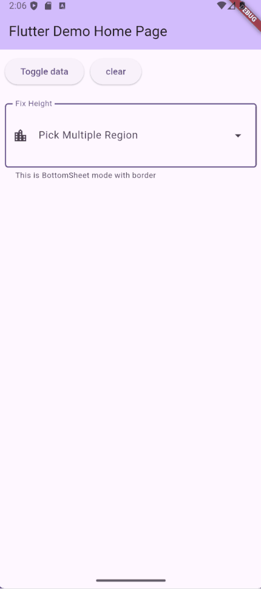
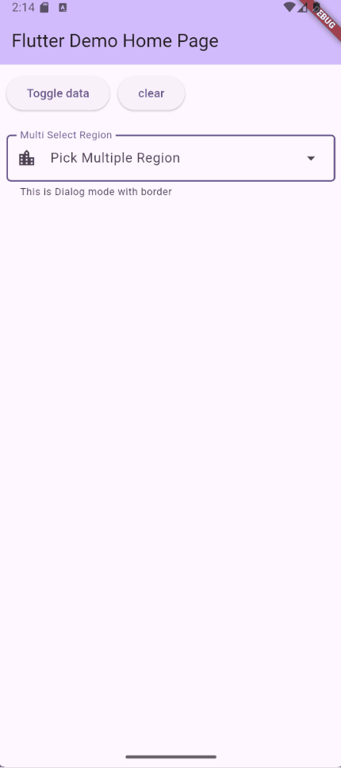
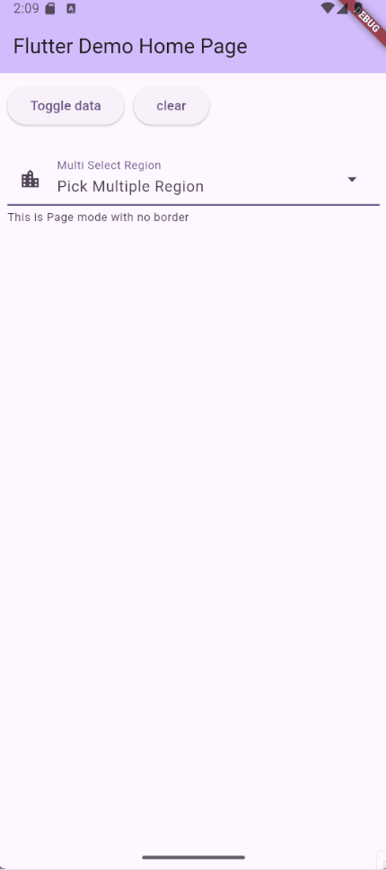
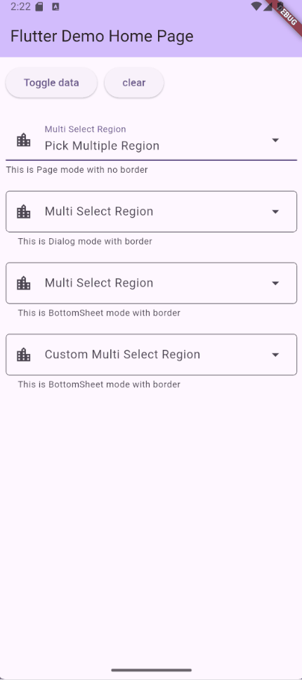

# 🧮 MultiDataPicker

  [](https://saweria.co/hrlns) [](https://ko-fi.com/M4M81N5IYI)

`multi_data_picker` is a customizable multi-select widget for Flutter, inspired by the UX of [Select2](https://select2.org/) and architecturally based on the `any_field` pattern. It allows users to select multiple values from dynamic data sources with support for generic types, popup customization (`dialog`, `page`, `bottom`), and external state control via `MultiPickerController`.

Designed to integrate seamlessly into form layouts, it supports full `TextField` styling via `InputDecoration`, making it visually consistent with standard Flutter input fields. Ideal for filter panels, tag selectors, and data-driven workflows.

---

## ✨ Features

- ✅ Generic support for any data type `T`
- 🧱 Custom display builder (text or widget)
- 🪟 Popup picker: `dialog`, `page`, or `bottom`
- 🎛️ Controller support for external state management
- 🧩 TextField-style appearance via `InputDecoration`
- 🔄 Initial value and change detection hooks
- 📐 Layout, spacing, and tile styling options

---

## 📸 Demo

| Fix Height | Dialog Picker | Page Picker |
|----------|------|-------------|
|  |  |  |
| Custom | Use Controller |-------------|
|  |  |   |

---

## 📦 Installation

Add this to your `pubspec.yaml`:

```yaml
dependencies:
  multi_data_picker: ^<latest_version>
```

Then run:

```bash
flutter pub get
```

---

## 🚀 Usage

```dart
MultiDataPicker<Map<String, dynamic>>(
  initialValue: [data[0], data[1]],
  isEqual: (a, b) => a["id"] == b["id"],
  decoration: InputDecoration(
    labelText: "Input Label",
    prefixIcon: Icon(Icons.location_city),
    border: OutlineInputBorder(
      borderRadius: BorderRadius.circular(5),
    ),
  ),
  minHeight: 100,
  maxHeight: 150,
  dataDisplayBuilder: DataDisplayBuilder.string(
    labelBuilder: (data) => data['name'] ?? "-",
  ),
  popupType: DataPickerPopupType.bottom(
    loadData: loadData,
    listDataBuilder: ListDataBuilder.string(
      labelBuilder: (data) => data['name'] ?? "-",
    ),
  ),
)
```

---

## 🧱 Constructor Parameters

| Parameter | Type | Description |
|----------|------|-------------|
| `dataDisplayBuilder` | `DataDisplayBuilder<T>` | Defines how each selected item is rendered ([see details](#-display-builder)) |
| `popupType` | `DataPickerPopupType<T>` | Controls the popup dialog behavior ([see details](#-popup-types)) |
| `isEqual` | `bool Function(T a, T b)?` | Optional equality function for comparing items. **Required when controller not exist** |
| `controller` | `MultiPickerController<T>?` | Optional controller to manage selected values ([see details](#-multipickercontroller)) |
| `initialValue` | `List<T>?` | Initial selected values |
| `decoration` | `InputDecoration` | Input field decoration |
| `displayPadding` | `EdgeInsets` | Padding around displayed items |
| `onChanged` | `Function(List<T>)?` | Callback when selection changes |
| `displaySpacing` | `double` | Horizontal spacing between items |
| `displayRunSpacing` | `double` | Vertical spacing between wrapped items |
| `minHeight` / `maxHeight` | `double?` | Height constraints |
| `topCompensation`, `leftCompensation`, `rightCompensation` | `double?` | Layout compensation values |
| `errorHeightCompensation`, `herlperHeightCompensation` | `double?` | Compensation for error/helper text spacing |

---

## 🧩 Display Builder

The `DataDisplayBuilder<T>` sealed class defines how each selected item is rendered inside the picker. It supports two modes:

### 1. `DataDisplayBuilder.string`

Renders each item as a `Chip` with customizable appearance.

---
| Parameter             | Type                          | Description |
|----------------------|-------------------------------|-------------|
| `labelBuilder`        | `String Function(T data)`      | Required. Builds the label text for each item |
| `backgroundColor`     | `Color?`                       | Background color of the chip |
| `labelStyle`          | `TextStyle?`                   | Style applied to the label text |
| `shape`               | `OutlinedBorder?`              | Shape of the chip |
| `deleteIconColor`     | `Color?`                       | Color of the delete icon |
| `deleteIcon`          | `Widget?`                      | Custom delete icon widget |
| `avatar`              | `Widget?`                      | Avatar widget displayed on the chip |
| `avatarBoxConstraints`| `BoxConstraints?`              | Constraints for the avatar widget |
| `labelPadding`        | `EdgeInsetsGeometry?`          | Padding around the label text |
| `side`                | `BorderSide` (default: none)   | Border side configuration |
---

#### Example:

```dart
DataDisplayBuilder.string(
  labelBuilder: (data) => data['name'] ?? "-",
  backgroundColor: Colors.blue.shade50,
  labelStyle: TextStyle(fontWeight: FontWeight.bold),
  shape: StadiumBorder(),
  deleteIconColor: Colors.red,
  deleteIcon: Icon(Icons.close),
  avatar: CircleAvatar(child: Text("A")),
  avatarBoxConstraints: BoxConstraints.tight(Size(24, 24)),
  labelPadding: EdgeInsets.symmetric(horizontal: 8),
  side: BorderSide(color: Colors.grey),
)
```

### 2. `DataDisplayBuilder.custom`

Provides full control over rendering via a custom widget builder.

---
| Parameter | Type | Description |
|----------|------|-------------|
| `builder` | `Widget Function(BuildContext context, T data, void Function() delete)` | Required. Custom widget builder for rendering each item with delete support |
---

#### Example:

```dart
DataDisplayBuilder.custom(
  builder: (context, data, delete) {
    return Row(
      children: [
        Text(data['name']),
        IconButton(
          icon: Icon(Icons.delete),
          onPressed: delete,
        ),
      ],
    );
  },
)
```

Use this when you need advanced layout or interactivity beyond the default `Chip` UI.

---

## 🪟 Popup Types

The `popupType` parameter defines how the selection UI is presented. It uses a sealed class `DataPickerPopupType<T>` with three variants:

### 1. `dialog`

Displays a modal dialog with optional title, search input, and action buttons.

```dart
DataPickerPopupType.dialog(
  loadData: loadData,
  listDataBuilder: ListDataBuilder.string(
    labelBuilder: (data) => data['name'] ?? "-",
  ),
  titleText: "Dialog Title",
)
```

### 2. `page`

Displays a full-screen modal page.

```dart
DataPickerPopupType.page(
  loadData: loadData,
  listDataBuilder: ListDataBuilder.string(
    labelBuilder: (data) => data['name'] ?? "-",
  ),
  titleText: 'Choose Options',
  withCancelButton: true,
)
```

### 3. `bottom`

Shows a bottom sheet for quick, contextual selection.

```dart
DataPickerPopupType.bottom(
  loadData: loadData,
  listDataBuilder: ListDataBuilder.string(
    labelBuilder: (data) => data['name'] ?? "-",
  ),
  titleText: 'Choose Options',
  withCancelButton: true,
)
```

### 🪟 Popup Type Parameters

| Parameter               | Type                                      | Description                                                                 | Used In             |
|------------------------|-------------------------------------------|-----------------------------------------------------------------------------|---------------------|
| `loadData`             | `ListDataPickerCallback<T>`               | Required. Callback to load data with filter and previous selection         | All                 |
| `listDataBuilder`      | `ListDataBuilder<T>`                      | Required. Builder for rendering list items  ([see details](#-list-data-builder))                                | All                 |
| `title`                | `Widget?`                                 | Optional widget for the popup title                                        | All                 |
| `titleText`            | `String?`                                 | Optional text for the popup title                                          | All                 |
| `cancelText`           | `String?`                                 | Text for the cancel button                                                 | All                 |
| `selectText`           | `String?`                                 | Text for the select button                                                 | All                 |
| `cancelButtonStyle`    | `ButtonStyle?`                            | Style for the cancel button                                                | All                 |
| `selectButtonStyle`    | `ButtonStyle?`                            | Style for the select button                                                | All                 |
| `searchInputDecoration`| `InputDecoration?`                        | Decoration for the search input field                                      | All                 |
| `searchAutoFocus`      | `bool` (default varies by type)           | Whether the search input should autofocus                                  | All                 |
| `width`                | `double?`                                 | Width of the popup dialog                                                  | `dialog` only       |
| `height`               | `double?`                                 | Height of the popup dialog                                                 | `dialog`, `bottom`  |
| `withCancelButton`     | `bool` (default varies by type)           | Whether to show a cancel button                                            | `page`, `bottom`    |

**Notes:**
- `searchAutoFocus` defaults to `false` for `dialog` and `bottom`, and `true` for `page`.
- `withCancelButton` defaults to `false` for both `page` and `bottom`.
- `width` is only available in `dialog`; `height` is available in `dialog` and `bottom`.

---

## 🧾 List Data Builder

The `ListDataBuilder<T>` sealed class defines how each item in the popup selection list is rendered. It supports two modes:

### 1. `ListDataBuilder.string`

Displays each item as a simple text-based `ListTile`.

```dart
ListDataBuilder.string(
  labelBuilder: (data) => data['name'] ?? "-",
)
```

### 2. `ListDataBuilder.custom`

Provides full control over rendering via a custom widget builder.

```dart
ListDataBuilder.custom(
  builder: (context, data, metadata) {
    return Container(
      color: metadata.selected ? Colors.green.shade100 : null,
      child: Row(
        children: [
          Text(data['name']),
          if (metadata.isEven) Icon(Icons.star),
        ],
      ),
    );
  },
)
```

---

### 🧾 ListDataBuilder Parameters

| Parameter     | Type                                                                 | Description                                                                 | Used In         |
|---------------|----------------------------------------------------------------------|-----------------------------------------------------------------------------|-----------------|
| `labelBuilder`| `String Function(T data)`                                            | Required. Builds the label text for each item                              | `string`        |
| `style`       | `ListDataTileStyle?`                                                 | Optional. Customizes the appearance of the list tile                        | `string`        |
| `builder`     | `Widget Function(BuildContext, T data, ListTileMetadata metadata)`   | Required. Custom widget builder with metadata for selection and index       | `custom`        |

---

### 🧾 ListTileMetadata

This helper class provides metadata for each item in the list:

| Property   | Type    | Description                                      |
|------------|---------|--------------------------------------------------|
| `selected` | `bool`  | Whether the item is currently selected           |
| `isEven`   | `bool`  | Whether the item is at an even index in the list |

Use this metadata inside `ListDataBuilder.custom` to style or annotate items dynamically.

---

## 🎮 MultiPickerController

`MultiPickerController<T>` is an optional controller that allows external control over the selected values in `MultiDataPicker`. It enables programmatic selection, deselection, toggling, and clearing of items, and notifies listeners when changes occur.

### Example

```dart
final controller = MultiPickerController<Map<String, dynamic>>(
  isEquals: (a, b) => a['id'] == b['id'],
  initialValue: [data[0]],
);

MultiDataPicker<Map<String, dynamic>>(
  controller: controller,
  isEqual: controller.isEquals,
  // other parameters...
);
```

---

### 🎮 Controller API

| Member         | Type / Signature                                      | Description |
|----------------|--------------------------------------------------------|-------------|
| `values`       | `List<T>` (getter)                                     | Returns the current selection (unmodifiable) |
| `values`       | `set(List<T>)`                                         | Replaces the current selection and notifies listeners |
| `isSelected`   | `bool Function(T item)`                                | Checks if an item is currently selected |
| `select`       | `void Function(T item)`                                | Adds an item to the selection if not already selected |
| `deselect`     | `void Function(T item)`                                | Removes an item from the selection if present |
| `toggle`       | `void Function(T item)`                                | Toggles selection state of an item |
| `clear`        | `void Function()`                                      | Clears all selected items |

---

## 🤝 Contributing

We welcome contributions! Feel free to open issues, submit pull requests, or suggest improvements.

```bash
git clone https://github.com/your-org/multi_data_picker.git
```
---

## ☕ Support This Project

If you find `multi_data_picker` helpful, consider supporting its development:

[](https://ko-fi.com/M4M81N5IYI)

---

## 📄 License

MIT License - see the [LICENSE](LICENSE) file for details
